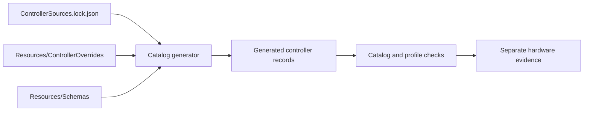

# Controller Data Ownership

Load this reference when choosing an authored catalog input or classifying evidence.

## Authored Inputs

- `ControllerSources.lock.json` pins an upstream revision and hash. Moving branches are review inputs only.
- `Resources/ControllerOverrides/<vid>/<vid>-<pid>.json` contains a complete `add` or a narrow `patch`.
- `Resources/Schemas/` owns document shape. Committed JSON uses decimal numbers and lowercase VID/PID paths.
- `Sources/OpenJoystickDriverKit/Protocol/` owns shared parser and transport behavior.

`Sources/OpenJoystickDriverKit/Resources/Controllers/` is generated. Change an authored input, run `./Scripts/ojd catalog regenerate --write`, then inspect the complete generated diff.

## Evidence Classes

| Class | Establishes | Does not establish |
| --- | --- | --- |
| Source-backed | upstream identity and classification | macOS open or hardware behavior |
| Packet/parser-backed | behavior for supplied reports | physical descriptors or reconnect |
| Record-probe-backed | candidate record opens and decodes in the probe | every control, actuator, or consumer |
| Hardware-verified | recorded physical result for one claim | other OS versions, modes, or models |

Keep source revisions in the lockfile and evidence status in testing pages, issues, and Git history. Controller records contain operational facts only.
