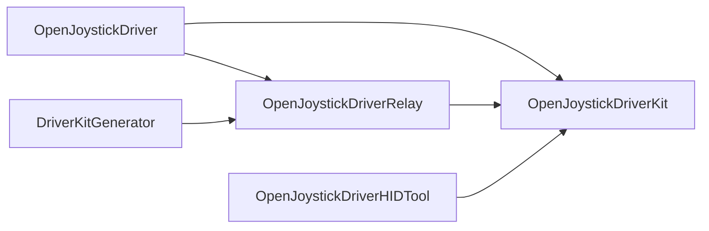

# Product Boundaries

Load this reference before changing imports, transport ownership, application service, canonical inputs, or generated output. `docs/development/source-topology.md` is authoritative for moves.

- `OpenJoystickDriverKit` owns reusable controller, protocol, remapping, output, and service contracts. It never imports SwifterKit.
- `OpenJoystickDriver` is the composition root. It owns app lifecycle, platform adapters, one `ApplicationServiceRuntime`, and one authenticated RPC socket.
- `OpenJoystickDriverRelay` and `DriverKitGenerator` own SwifterKit integration and generated native-project input.
- `OpenJoystickDriverUSB` owns app-side IOUSBHost and USBDriverKit transport access.

## Generated Boundaries

- `.build/driverkit/generated/` is ephemeral. Change generator inputs and run `./Scripts/ojd driverkit generate`.
- `Sources/OpenJoystickDriverKit/Resources/Controllers/` is generated. Change pinned sources or `Resources/ControllerOverrides/`, then regenerate the catalog.
- Package resources, entitlements, RPC payloads, and the DriverKit user-client allowlist are contracts.

Before editing, identify the target, public seam, lifecycle, failure owner, canonical input, generated output, and matching test. Route a new owner or source/test move to `$organize-openjoystickdriver`.
