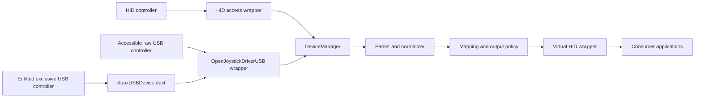
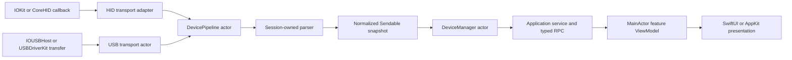
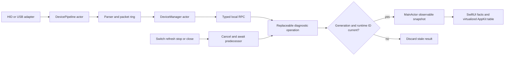

# Architecture

OpenJoystickDriver ships one application bundle, one persistent host process, and one generated
USBDriverKit system extension. The app owns controller semantics, virtual output, authenticated
local commands, and the AppKit menu/settings UI. Most accessible raw USB interfaces are opened
directly by the app. The DEXT is a restricted owner for devices covered by OJD's Apple-issued USB
transport entitlement.

## Controller ownership and concurrency

`DeviceManager` is the inventory actor and the only owner of physical discovery and exact-device
selection. Each connected device has one `DevicePipeline` actor, created, replaced, and stopped by
the manager. The pipeline exclusively owns its mutable parser, normalized input/output state,
transport coordination, and retained run and idle tasks.

- HID and USB adapters own platform handles and translate callbacks or transfers into copied data.
- Decoding and controller state mutation execute only on the pipeline actor, never on `@MainActor`.
- Parser protocols are intentionally not `Sendable`; a parser is transferred once into its session.
- USB startup, keep-alive, and physical output are parser-produced value plans executed by the
  pipeline's transport session, keeping device I/O out of decoding objects.
- Replacement and shutdown cancel and await established session tasks before the old pipeline is
  discarded. A non-cooperative platform open that has not produced a session cannot block shutdown;
  its late result observes the inactive generation and is closed without publishing state.
- `@MainActor` owns application, window, menu, panel, and observable presentation state only.

### Developer diagnostics lifetime

Developer diagnostics observe the existing service-owned sessions; they never open a second HID or
USB reader. One replaceable operation owns the selected controller snapshot and packet-capture
request. Replacing, refreshing, stopping, or closing first cancels and awaits that operation, then
starts or publishes only for the current generation and exact runtime identifier.

Packet differencing, classification, and bulk formatting stay outside `@MainActor`. The main actor
owns only AppKit/SwiftUI lifecycle and publication of bounded, already-derived presentation
snapshots. The complete raw capture remains authoritative for copy and export; table virtualization
changes rendering cost, not capture contents or device cadence.

## Platform split

The package deployment floor remains macOS 10.15. Availability selection happens once inside each
HID wrapper; callers do not repeat OS checks.

| Capability | macOS 10.15–14 | macOS 15+ |
| --- | --- | --- |
| Physical HID discovery and reports | `IOHIDManager` / `IOHIDDevice` | CoreHID `HIDDeviceManager` / `HIDDeviceClient` |
| Consumer virtual HID | `IOHIDUserDevice` | CoreHID `HIDVirtualDevice` |
| Raw/custom USB | app-side IOUSBHost or restricted USBDriverKit DEXT | app-side IOUSBHost or restricted USBDriverKit DEXT |
| HID DEXT implementation | HIDDriverKit when needed | HIDDriverKit when needed |

The older implementations are marked
`@available(macOS, introduced: 10.15, obsoleted: 15.0)`. CoreHID implementations are marked
`@available(macOS 15.0, *)`, CoreHID is weak-linked, and the wrapper selects with `#available`.
The macOS 10.15–14 implementation is an active platform variant, not a fallback on macOS 15+.

## USB transport boundary

`OpenJoystickDriverKit` owns the asynchronous `USBTransportProvider` and `USBTransportSession`
ports plus all parsing and controller policy. It never imports SwifterKit.
`OpenJoystickDriverUSB` is the app-side platform facade. Its direct backend opens accessible
vendor-specific interfaces with IOUSBHost. Its USBDriverKit backend talks to OJD's restricted DEXT.
The facade owns discovery, session lifetimes, transfers, configuration/alternate-setting requests,
and platform error translation. Parsers and application callers receive one route-tagged API and
never handle IOUSBHost, DriverKit, or SwifterKit types.

Selection follows ownership evidence, not controller brand. A service exposed by the DEXT stays on
that route. Models covered by the production USB transport entitlement never silently fall back to
direct app-side access. Other raw USB controllers use IOUSBHost when macOS permits the app to own
their interface. Failure to open one route is reported instead of retried through another route.

`DriverKitGenerator` consumes the sole `USBDriverKitExtensionConfiguration`. Development and
production generation both match only Apple's approved Microsoft pairs:
`045E:02D1`, `045E:02DD`, `045E:02E3`, `045E:02EA`, `045E:0B00`, `045E:0B0A`, and `045E:0B12`.
The configuration uses bundle identifier `com.openjoystickdriver.XboxUSBDevice`, provider
`IOUSBHostInterface`, configuration 1, interface 0, class `0xFF`, subclass `0x47`, and protocol
`0xD0`. Accessible third-party GIP controllers such as `3537:1010` stay on the direct IOUSBHost
route; their catalog profile may request configuration 1 before the facade resolves an interface.

The DEXT does not parse controller protocols and does not create virtual HID devices. Its
entitlements contain only the DriverKit base entitlement and the appropriate USB transport value.
`com.apple.developer.hid.virtual.device` belongs only to the app. The app's DriverKit user-client
allowlist contains exactly `com.openjoystickdriver.XboxUSBDevice`; allow-any access is forbidden.
The external XboxUSBDevice identity remains unchanged because it is the identity Apple approved;
the internal transport abstractions are controller-neutral.

See [Apple controller ownership evidence](apple-controller-ownership.md) for the installed-system
observations, entitlement scope, and why an Apple personality list is not OJD's support catalog.

Every DriverKit build generates a fresh native project under `.build/driverkit/generated/` and
builds under `.build/driverkit/derived-data/`. Generated output is ephemeral and is never edited or
committed. `./Scripts/ojd check driverkit` checks the entitlement, personality, determinism,
dependency direction, and an unsigned universal build.

## Process and command lifecycle

Launching the signed app starts the runtime, one status item, and one reusable settings window.
Closing settings does not stop controller processing. `SIGTERM` and `SIGINT` stop the runtime
cleanly. Headless commands invoke the same executable and reach live state through the private
Unix-domain socket at `/tmp/com.openjoystickdriver.<uid>.rpc`. The socket is mode `0600`; the server
requires the same user, signing identifier, and team identifier. Frames and deadlines are bounded.
Repository-built CLI commands use the installed signed executable when it is available. This keeps
`swift run` and direct `.build` commands within the same RPC authentication boundary; the server does
not need to trust unsigned development clients. Forwarding stops when the installed executable is
older than the repository sources, so validation cannot silently run stale CLI code.

## Permissions

- The app carries `com.apple.developer.hid.virtual.device` for CoreHID virtual devices.
- The macOS 10.15–14 IOKit HID implementation retains its evidenced Input Monitoring and
  Accessibility checks.
- CoreGraphics post-event access independently authorizes remapped keyboard, pointer, and scroll
  events.
- The USB DEXT uses DriverKit/USB provisioning and has no virtual-HID entitlement.

Hardware access, signing, activation, and permission behavior still require focused signed-device
validation; an unsigned build cannot prove those boundaries.
